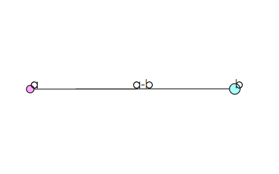

# d3graph

d3graph is a javascript graph visualization tool base on d3.js.



1. For DAG (Directed Acyclic Graph) only.
2. Automatically layout nodes and edges.
3. Remember last layout and visualize the transition of graph with animation.

> An undirected graph can also be converted to a DAG, by assigning each node with a particular order.

## Usage

Call function `d3graph` to create a graph object, which provide the following interfaces:

- addNode(nodeId, data)
- delNode(nodeId)
- addEdge(edgeId, srcId, dstId, data)
- delEdge(edgeId)
- redraw(duration, ease)

`addNode(nodeId, data)` creates a new node indexed with `nodeId`, `addEdge(edgeId, srcId, dstId, data)` creates a directed edge from `srcId` to `dstId`, indexed with `edgeId`. The last parameter `data` will be sent to a callback to visualize the node or edge respectively.

`redraw(duration, ease)` resolve the layout of nodes and edges, and draw them in the container with user provided callbacks. With `duration` parameter, an animation will be launched to visualize the transition from the last layout to the current one. `duration` defines animation time in milliseconds, and `ease` defines the interpolate method, which is `cos` by default. See [d3.js document](https://github.com/mbostock/d3/wiki/Transitions#ease) for details. Call redraw() directly to draw the new graph without animation.

d3graph take 5 parameters:

- container
- width
- height
- drawNode(group, data)
- drawEdge(path, group, data)

Container is a selector where the graph should appear, typically a div. Width and height define the size of the visualization area. `drawNode` and `drawEdge` are callbacks defines how to draw nodes and edges.

d3graph will automatically resolve the layout of nodes and edges. For each node, a `group` will be created at the corresponding position, and passed to `drawNode` along with the `data` which is provided by `addNode`. For each edge, a `path` will be created according to the layout, also a `group` will be created at the middle of the `path`, both will be passed to `drawEdge`, along with the `data` provided by `addEdge`.

## Example

Following script generates the above [animation](#d3graph).

```javascript
const width = 800;
const height = 600;
const graph = d3graph(d3.select('#main'), // draw graph on the selected 'main' div
  width, height,
  function(group, data) { // drawNode function
    group.append('circle').attr('r', data.size).attr('stroke','#000').attr('fill', data.color);
    group.append('text').text(data.text);
  },
  function(path, group, data) { // drawEdge function
    path.attr('stroke','#000');
    if (data.dash) {
      path.attr('stroke-dasharray', data.dash);
    }
    group.append('text').text(data.text);
  }
);

graph.addNode('a', {text: 'a', size: 5, color: '#FAF'});
graph.addNode('b', {text: 'b', size: 7, color: '#AFF'});
graph.addEdge('a-b', 'a', 'b', {text: 'a-b'});
graph.redraw();

graph.addNode('c', {text: 'c', size: 3, color: '#FAA'});
graph.addEdge('a-c', 'a', 'c', {dash: [2,2]});
graph.redraw(500);

graph.addEdge('a-c-2', 'a', 'c', {});
graph.addEdge('b-c', 'b', 'c', {});
graph.redraw(500);
```

A random growing graph [example](http://yihe2.github.io/d3graph).

## Layout

First of all the nodes are topologically sorted and group by their level. Nodes with the same level share the same x-coordinates and group of nodes scatter from left to right uniformly. Then an order was optimized within each group to reduce the edge intersection.

Note that some edges may connect nodes with the same level, since the level is defined only by the distance from the initial nodes. Good news is that in such a way, no edge will spread over more than 2 levels.

## Notes

Notice that `delNode` deletes only the nodes, not their adjacent edges. These ghost edges will not be represented, until their adjacent nodes were added back to the graph.
